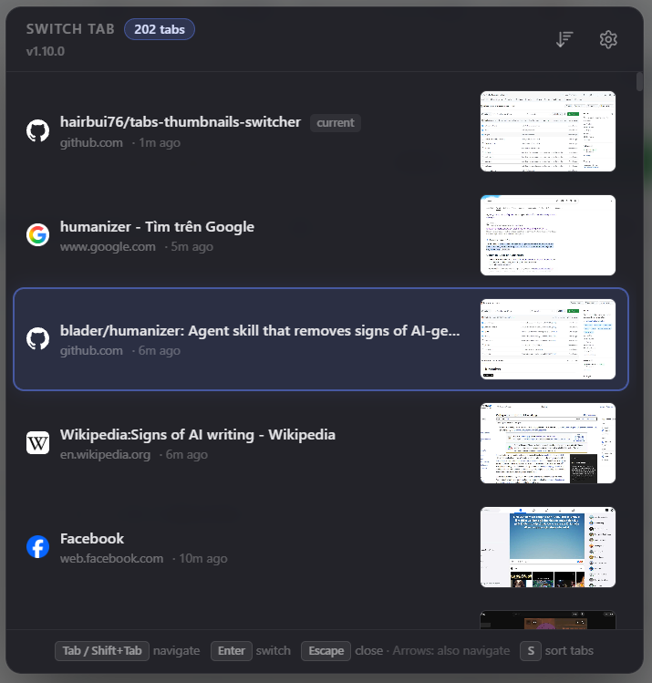
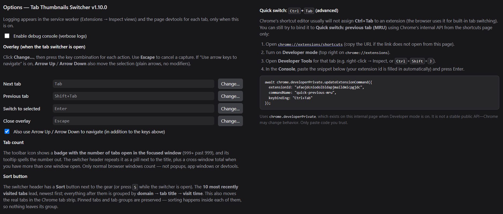

# Tab Thumbnails Switcher

A Chrome extension that switches tabs using **most recently used (MRU)** order, with **thumbnail** previews in an overlay when you use the long-press gesture or the toolbar button.

## Screenshots

|  |  |
| :---: | :---: |
| *Figure 1 — Tab switcher overlay: MRU-ordered tabs with thumbnails, version under the title, settings gear, and keyboard hints.* | *Figure 2 — Options page: debug logging toggle, overlay navigation keys, Ctrl+Tab advanced console snippet, and about metadata.* |

## Installation

1. Clone or download this repository
2. Open `chrome://extensions/` in Chrome
3. Enable **Developer mode** (toggle in the top-right corner)
4. Click **Load unpacked** and select this folder
5. The extension is now active

## Options (debug console)

- Right-click the extension icon → **Options**, or from `chrome://extensions` open **Extension options** for this extension.
- **Enable debug console (verbose logs)** — when off, `[TTS …]` logs are suppressed in the service worker and in page devtools. Default is off.
- **Overlay (when the tab switcher is open)** — set **Next / Previous / Switch to selected / Close** by clicking **Change…** and pressing a key (modifiers like Shift / Ctrl are captured). **Escape** cancels capture. The hint bar in the switcher uses these labels. You can also enable **Arrow Up / Arrow Down** for navigation in addition to your custom keys (default: on, same as the old behavior).
- **Quick switch: Ctrl+Tab (advanced)** — step-by-step instructions and a console snippet with your **extension id** already filled in (same idea as in [Can I use Ctrl+Tab for quick switch?](#can-i-use-ctrltab-for-quick-switch)).

## Keyboard shortcuts (`chrome://extensions/shortcuts`)

1. Open `chrome://extensions/shortcuts` and find **Tab Thumbnails Switcher**.
2. Suggested defaults (remap with the pencil if you like):
   - **Quick switch: previous tab (MRU) — no menu** — default **Ctrl+Shift+E**
   - **Open tab switcher (thumbnail menu)** — default **Ctrl+Shift+Q** (same chord as the in-page long-press; see `key-gesture.js`)
3. The manifest defines these in [`manifest.json`](manifest.json) under `commands`.

**Ctrl+Tab:** The normal shortcuts UI usually will not assign **Ctrl+Tab** to an extension (Chrome reserves it). See [Can I use Ctrl+Tab for quick switch?](#can-i-use-ctrltab-for-quick-switch) below for an **advanced** console workaround on `chrome://extensions/shortcuts`, or use **OS-level remapping** to send your chosen shortcut.

### When the overlay is open

| Key | Action |
|-----|--------|
| **Gear** (header, top right) | Opens the extension **options** page in a new tab. |
| **Tab count** (header, next to the title) | How many tabs are open — see [Tab count](#tab-count). |
| **Sort** (header, left of the gear) | Reorders the list **and the real Chrome tab strip** — see [Sorting](#sorting). |
| S | Same as the Sort button |
| Tab / Arrow Down | Move selection down |
| Shift+Tab / Arrow Up | Move selection up |
| Enter | Switch to selected tab |
| Escape | Close the switcher |
| Click a row | Switch to that tab |

If a configured navigation key is rebound to **S**, that binding wins and the sort shortcut is skipped.

## Tab count

The **toolbar icon carries a badge** with the number of tabs open in the focused window, repainted as tabs open, close, move between windows, or when you switch windows. Past 999 it reads `999+`. The icon's tooltip spells the same number out, next to the version.

The switcher header shows it too: a **`12 tabs`** pill next to the title, taken from the list on screen so the two can never disagree. When more than one window is open, a muted line under it adds the cross-window total — `30 tabs in 3 windows`. Hover the pill for both numbers at once.

Only normal browser windows are counted; popups, app windows and devtools carry tabs of their own that nobody thinks of as open tabs.

## Sorting

The **Sort** button in the switcher header (or **S** while it is open) applies one combined order:

**The 10 most recently visited tabs lead**, newest first — the window's global top 10, so what you were just working on stays within reach.

**Everything after them** is sorted by:

1. **Domain** (A→Z) — tabs of the same site end up next to each other.
2. **Tab title** (A→Z) — within one site.
3. **Newest visit first** — only as a tie-break on identical titles.

This is not just a view: the **real Chrome tab strip is reordered** to match, via `chrome.tabs.move`, and the switcher then shows the new strip order.

Tabs never leave the run they belong to, so nothing gets scrambled:

- **Pinned tabs** are sorted among themselves and stay in front. They are excluded from the recent-10 head, since they already sit at the front permanently and would otherwise starve the rest of the strip of head slots.
- **Tab groups** stay intact and in place — sorting happens inside each group.
- Each stretch of **ungrouped** tabs is sorted within itself. With no tab groups (the common case) that is the whole strip, so the sort is global.

The recent head is picked once per window, then each run leads with whichever of those tabs it happens to contain — so you get one top 10 overall, not a top 10 per group. Tabs never activated in this session have no visit time, are not eligible for the head, and land at the end of their site block.

## Can I use Ctrl+Tab for quick switch?

**Usually not through the pencil UI** — Chrome reserves **Ctrl+Tab** for built‑in tab switching, so the shortcuts page often will not let you pick it for **Quick switch: previous tab (MRU)**.

- **Default:** set **Quick switch** to any free combination in `chrome://extensions/shortcuts` (e.g. **Ctrl+Shift+E**).

If you specifically want **Ctrl+Tab**:

1. **Advanced (Chrome only, internal API)** — On `chrome://extensions/shortcuts`, with **Developer mode** enabled (toggle on `chrome://extensions`), open **Developer Tools** for that tab (e.g. right‑click → Inspect, or **Ctrl+Shift+J**). In the **Console**, paste (replace `YOUR_EXTENSION_ID` with the id shown under this extension on `chrome://extensions`; the **Options** page of this extension can show a ready‑to‑paste snippet with your id filled in):

   ```js
   await chrome.developerPrivate.updateExtensionCommand({
     extensionId: "YOUR_EXTENSION_ID",
     commandName: "quick-previous-mru",
     keybinding: "Ctrl+Tab"
   });
   ```

   This calls `chrome.developerPrivate`, which exists on that internal page when Developer mode is on. It is **not** a stable public API—Chrome may change or remove it. Only run snippets you trust.

2. **OS remap** — Map **Ctrl+Tab** (while Chrome is focused) to whatever key you assigned for quick switch in `chrome://extensions/shortcuts` (e.g. **Ctrl+Shift+E**) using an **OS tool** (e.g. Windows **AutoHotkey**). Same idea if you want **plain Ctrl+E** for quick switch: remap at the OS to the extension’s assigned shortcut.

## How it works

- **MRU** — The background script tracks the order you activate tabs; “previous” tab is the second entry in that list.
- **Quick switch** — The `commands` entry `quick-previous-mru` calls the same MRU “previous tab” action from the service worker (no overlay).
- **Thumbnails** — The visible tab is captured (JPEG) when it becomes active; that image is used in the switcher.
